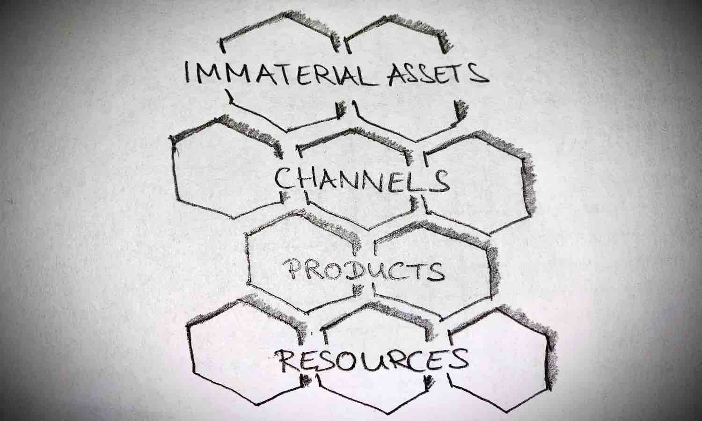

# Ownership
by Eva Tobin & Martin Naubert in the scope of the lecture Digital Organization

_Prof. Dr. Ulrich Anders - WS 2020_

---

# Agenda

1. Introduction
1. Concept of Ownership 
    * The Ownership Honeycomb
1. Responsibilities of Owners
1. Digital Ownership

---

# Agenda

5. What does it mean to work for a Company that values Ownership?
5. Applied Ownership in Companies
    * XYZ
    * XY 
5. Problems of Ownership
    * Apple Permissions Issues
5. Discussion

---

### 1. Introduction

Ownership can be applied to many different areas

This presentation focusses mainly on ownership from a digital, organizational and software perspective 

Ownership is considered as taking the responsibility for anything 

---

### 2. Concept of Ownership

* Objects in a business should only have one owner
* No object should be ownerless
* Objects fall into one of these categories:
    * Products
    * Ressources
    * Channels
    * Immaterial assets
    
> The honeycomb of ownership    

---

### 2. Concept of Ownership

* Companies must allocate unique ownership for objects
* More than one owner can delay the achievement of goals

---

### 2. Concept of Ownership - The Honeycomb

---

### 3. Responsibilities of Owners

---

### 3. Responsibilities of Owners

* One should organize responsibilities in companies by ownership -> not by functions 
* Ownership must be decided, established and removed by top level managers of a business
* Only owner chooses how to use and change an object
* Has full responsibility about object maintanance and development

---

### 3. Responsibilities of Owners

* Can make use of other owners' products and ressources for his purposes 
* Gets financial aid for object management 
* Passes on ownership 
* Can lend porperties to others and give modifications rights
* Owners are supported by their teams

---

### 4. Digital Ownership

*Fundamental Question*: If you buy an object, does the associated data, information, knowledge belong to you? Do you own the object digitally as well?

---

### 4. Digital Ownership

Digital ownership is the 

_"abillity to acces the information and knowledge of physically owned objects at any time, anywhere and use them and control the access of other users to it"_ 

(Kusper, 2014)

---

### 4. Digital Ownership

* Permission to access and use data and knowledge about ourselves and about objects we own
* Can grant or revoke rights on this data
* Helps to gain control on huge data
* Sum of data = digital treasure
* Layer of IoT: Easily accessing information about own objects is challenging -> IoT infrastructure has not been built yet
* In the information society digital ownership is a natural basic right

---

### 5. What does it mean to work for a Company that values Ownership?

* Taking initiative to bring about positive results
* Do not wait for others to acts; care as much about outcome as the company owner would
* Be accountable for results of actions - highest quality & delivered on time 
* Show others that they can trust you to do the right thing

---

### 5. What does it mean to work for a Company that values Ownership?

_"Ownership means I have an obligation to the organization in terms of results, and that I have an obligation to act on the items that impact those results. I may have to assemble a team to help me bring about results, but ultimately, I must be accountable and own the results of my actions."_

(Wilms, 2017)

---

### 6. Applied Ownership in Companies

---

### 7. Problems of Ownership

   * Apple Permission Issues 
* Permission errors usually associated with Linux and MacOS installations 
* Files and directories have three operation privileges available: read ®, write (w) and execute (x)
* System user can perform different operations depending on their operation privileges and the groups this user belongs to

---

### 7. Problems of Ownership

* Permission issue occurs when an application (or system user) is performing unauthorized operation in the filesystem
* GibHub example -> Microsoft program causes problems when used on MacOS

---

# _Thank you for your Attention_

