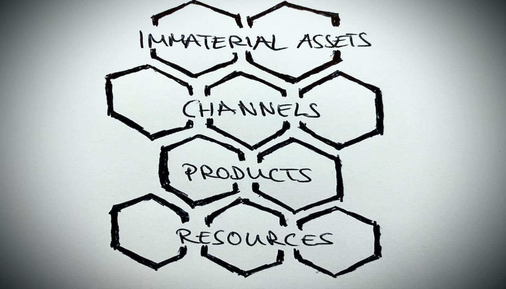

# Ownership
by Eva Tobin & Martin Naubert in the scope of the lecture Digital Organization

_Prof. Dr. Ulrich Anders - WS 2020_

---

# Agenda

1. Introduction
1. Concept of Ownership 
    * The Ownership Honeycomb
1. Responsibilities of Owners
1. Digital Ownership
1. What does it mean to work for a Company that values Ownership?

---

# Agenda

6. Applied Ownership in Companies
    * TVNOW
6. Problems of Ownership
    * Apple Permissions Issues
6. Discussion

---

### 1. Introduction

* Ownership can be applied to many different areas

* Focus set mainly on ownership from a digital, organizational and software perspective 

* Ownership is considered as taking the responsibility for anything 

---

### 2. Concept of Ownership

* Objects in a business should only have one owner
* No object should be ownerless
* Objects fall into one of these categories:
    * Products
    * Resources
    * Channels
    * Immaterial assets
    
> The honeycomb of ownership    

---

### 2. Concept of Ownership

* Companies must allocate unique ownership for objects
* More than one owner can delay the achievement of goals

---
##### 2. Concept of Ownership - The Honeycomb

###### [© Prof. Dr. Ulrich Anders · concepts cards© license CC BY-NC-ND 4.0 ](https://ulrich-anders.eu/papers/Prof-Dr-Ulrich-Anders_concept-card_Ownership_v1.1.0.pdf)

---

### 2. Concept of Ownership 
#### The Honeycomb - _Products_

* Understand stakeholder needs
* Determine if the need is worth satisfying
* Determine the best solution to satisfy it
* Build a shared understanding of the solution

> Ensure most valuable and proper functionality of product

---

### 2. Concept of Ownership 
#### The Honeycomb - _Products_

> The product owner...

 ...is a products key stakeholder

 ...has a vision what to build 

...needs to understand users, marketplace, competition and future trends

...has to motivate the team members and communicate

---

### 3. Responsibilities of Owners

---

### 3. Responsibilities of Owners

* Organize responsibilities in companies by ownership 
* Ownership must be decided, established and removed by top level managers 
* Owner chooses how to use and change an object
* Full responsibility about object maintanance and development

---

### 3. Responsibilities of Owners

* Make use of other owners' products and ressources for his purposes 
* Gets financial aid for object management 
* Pass on ownership 
* Give modifications rights
* Owners are supported by their teams

---

### 4. Digital Ownership

*Fundamental Question*: If you buy an object, does the associated data, information and knowledge belong to you? Do you own the object digitally as well?

---

### 4. Digital Ownership

Digital ownership is the 

_"ability to access the information and knowledge of physically owned objects at anytime, anywhere, and to use them and control the access of other users to it."_ 

(Kusper, 2014)

---

### 4. Digital Ownership

* Permission to access and use data 
* Provide or revoke rights
* Gain control on huge data
* Internet of Things 

---

### 5. What does it mean to work for a Company that values Ownership?

* I can make a difference within the organization 
* I have the support of the leadership team 
* I can chase down my passions and incorporate that into my position 
* I feel trusted 

---

### 5. What does it mean to work for a Company that values Ownership?

_"Ownership means I have an obligation to the organization in terms of results, and that I have an obligation to act on the items that impact those results. I may have to assemble a team to help me bring about results, but ultimately, I must be accountable and own the results of my actions."_

(Wilms, 2017)

---

### 6. Applied Ownership in Companies

* Taking initiative
* Do not wait for others to act
* Be accountable for results
* Show others that they can trust you

---

### 6. Applied Ownership in Companies 

> TVNOW

---

### 7. Problems of Ownership

_"Data has become ever more important for businesses, yet the issue of who owns it has become equally more difficult to determine."_

(Williamson, 2018)

---

### 7. Problems of Ownership

> Example: automobile drivertrain with complex softwares

_Who owns the data being generated – the driver, the dealer, the OEM or the supplier?_

---

### 7. Problems of Ownership 

_"A question about data ownership on its own is too simplistic. A better question would be, who can most benefit from owning that data? In the case of the drivetrain, you would ultimately expect that to probably be the dealer and the manufacturer."_

(Williamson, 2018)

---

### 7. Problems of Ownership 

> Businesses and industry can’t continue to operate in an international grey area, especially as technology evolves. 

---

### 7. Problems of Ownership

Apple Permission Issues

* Permission errors usually associated with MacOS installations
* Ownership & permission errors can occur when account has been moved or file owner was modified 

---

### 7. Problems of Ownership

Apple Permission Isssues 

* Occur when an application (or system user) is performing unauthorized operation in the filesystem
> GitHub example -> Microsoft program causes problems when used on Mac

---

### 8. Discussion

> Has anybody experienced ownership issues in organisations?

---

# _Thank you for your Attention!_

